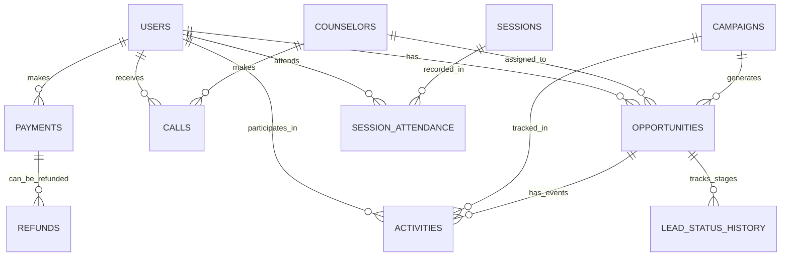

# Project Walkthrough: Customer Lifecycle Intelligence Platform

This document summarizes the technical implementation and architecture of the data generation and containerization phase.

## 1. Project Architecture

The platform is designed to be fully portable using Docker, but flexible enough to be developed on a local Mac terminal.

- **Database**: MySQL 8.0 (Containerized)
- **Application**: Python 3.12/3.14 (SQLAlchemy + Pandas + Faker)
- **Networking**: Dual-access support (Internal Docker network + External Host access)

---

## 1.1 Why Docker? (The Benefits)

We implemented Docker and a containerized workflow to solve several key challenges:

1. **Environmental Consistency**: By using a Docker container for the app, we ensure that every developer uses the exact same version of Python and libraries. This prevents the "Module Not Found" or "Runtime Errors" often caused by local version mismatches (like we saw with Python 3.14).
2. **Simplified Database Setup**: You don't need to install MySQL on your Mac. Docker spins up a pre-configured MySQL 8.0 instance with the correct settings and passwords automatically.
3. **Isolated Networking**: Docker creates a private network where the app can always find the database at the hostname `db`. Our "Smart Detection" logic then bridges this to your host terminal for easy local development.
4. **Nuclear Reset Capability**: If the data or environment gets corrupted, you can simply run `docker-compose down -v` to wipe everything and start fresh in seconds.

---

## 2. Database Schema (ERD)

The following diagram illustrates the relationships between the 11 tables generated:



## 3. Key Technical Implementations

### Smart Connection Detection
Both `data_generation.py` and `check_db.py` now feature an auto-detection logic that switches between Docker and Local environments:
- **Inside Docker**: Connects to `db:3306`.
- **In Terminal**: Connects to `127.0.0.1:3306` (the primary edtech_db port).

### Environment Stability
We resolved several critical blockers:
- **Authentication**: Added the `cryptography` package to support MySQL 8's default authentication from Python.
- **Python 3.14 Compatibility**: Rebuilt the virtual environment to ensure `Faker` and `PyMySQL` work correctly on the latest experimental Python versions.
- **Schema Management**: Updated insertion logic to use `if_exists="replace"`, allowing the database schema to evolve automatically as new columns are added to the code.

## 4. How to Run

### Option A: Via Docker (Recommended)
Run everything in a clean, isolated environment:
```bash
docker-compose up -d db
docker-compose run --rm app
```

### Option B: Via Local Terminal
Run the scripts using your local virtual environment:
```bash
./.venv/bin/python data_generation/data_generation.py
./.venv/bin/python data_generation/check_db.py
```

## 5. Current Data Snapshot (Verified)
| Table | Records | Purpose |
| :--- | :--- | :--- |
| **Activities** | 150,000 | Emails, meetings, and notes |
| **Users** | 10,000 | Master user list |
| **Opportunities** | 10,000 | Sales leads linked to campaigns |
| **Lead History** | 100,000 | Funnel stage tracking |
| **Calls** | 50,000 | Interaction logs |
| **Attendance** | 300,000 | Session engagement |
| **Payments** | 20,000 | Financial records |

## 6. Quick Reference: Useful Commands

### Docker Compose
| Task | Command |
| :--- | :--- |
| **Start everything** | `docker-compose up -d` |
| **Stop everything** | `docker-compose down` |
| **Start specific service** | `docker-compose up -d db` |
| **Start specific container** | `docker start 4483aa3079858adf627dfd7f239167fccff757a6f712effc4ec89d0d5f70a2b1` |
| **View logs** | `docker-compose logs -f` |
| **Check status** | `docker-compose ps` |
| **Restart DB** | `docker-compose restart db` |

### Data Generation & Verification
| Task | Docker Method | Local Terminal Method |
| :--- | :--- | :--- |
| **Generate Data** | `docker-compose run --rm app` | `./.venv/bin/python data_generation/data_generation.py` |
| **Verify Counts** | `docker-compose run --rm app python data_generation/check_db.py` | `./.venv/bin/python data_generation/check_db.py` |

### Database Access
| Task | Command |
| :--- | :--- |
| **MySQL Console** | `mysql -h 127.0.0.1 -P 3306 -u root -p edtech` |
| **Inspect DB Logs** | `docker logs edtech_db` |
| **Clean Volumes** | `docker-compose down -v` |

---
**Note**: The default password for the database is `password`.
