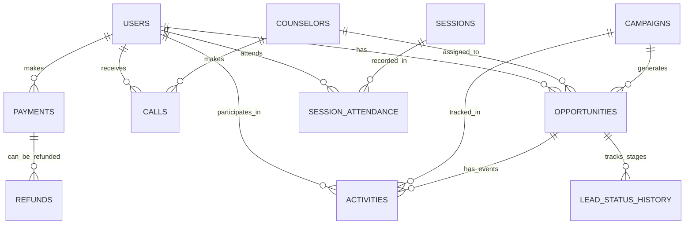

# Project Walkthrough: Customer Lifecycle Intelligence Platform

This document summarizes the technical implementation and architecture of the data generation and containerization phase.

## 1. Project Architecture

The platform is designed to be fully portable using Docker, but flexible enough to be developed on a local Mac terminal.

- **Database**: MySQL 8.0 (Containerized)
- **Application**: Python 3.12/3.14 (SQLAlchemy + Pandas + Faker)
- **Networking**: Dual-access support (Internal Docker network + External Host access)

---

## 1.1 Why Docker? (The Benefits)

We implemented Docker and a containerized workflow to solve several key challenges:

1. **Environmental Consistency**: By using a Docker container for the app, we ensure that every developer uses the exact same version of Python and libraries. This prevents the "Module Not Found" or "Runtime Errors" often caused by local version mismatches (like we saw with Python 3.14).
2. **Simplified Database Setup**: You don't need to install MySQL on your Mac. Docker spins up a pre-configured MySQL 8.0 instance with the correct settings and passwords automatically.
3. **Isolated Networking**: Docker creates a private network where the app can always find the database at the hostname `db`. Our "Smart Detection" logic then bridges this to your host terminal for easy local development.
4. **Nuclear Reset Capability**: If the data or environment gets corrupted, you can simply run `docker-compose down -v` to wipe everything and start fresh in seconds.

---

## 2. Database Schema (ERD)

The following diagram illustrates the relationships between the 11 tables generated:



## 3. Key Technical Implementations

### Configuration System (YAML & Constants)
The platform now uses a **YAML-based configuration system**. This allows you to change database credentials or data quality parameters (like `null_probability`) in `config/config.yaml` without touching the Python code. Table names and business stages are managed in `config/constants.py` for global consistency.

### Smart Connection Detection
The system automatically detects the environment:
- **Docker**: Connects via the internal network (`db` hostname).
- **Local**: Uses the settings defined in `config.yaml` (defaulting to `localhost:3333`).

### Environment Stability & Packages
We converted the project into standard Python packages by adding `__init__.py` files. This allows for clean imports between the `config` and `data_generation` modules.

---

## 4. How to Run

### Option A: Via Docker (Recommended)
```bash
docker-compose up -d db
docker-compose run --rm app
```

### Option B: Via Local Terminal
The project now runs in **module mode** to handle package imports correctly:
```bash
# Set PYTHONPATH to the current directory
export PYTHONPATH=$PYTHONPATH:.
python -m data_generation.data_generation
python -m data_generation.check_db
```

---

## 5. Current Data Snapshot (Updated)
| Table | Records | Purpose |
| :--- | :--- | :--- |
| **Activities** | 150,000 | Emails, meetings, and notes (linked to Opps/Campaigns) |
| **Users** | 10,000 | Master user list |
| **Opportunities** | 10,000 | Sales leads linked to campaigns |
| **Lead History** | 100,000 | Funnel stage tracking |
| **Calls** | 50,000 | Interaction logs |
| **Attendance** | 30,000 | Session engagement tracking |
| **Payments** | 10,000 | Financial records |
| **Campaigns** | 500 | Marketing source tracking |

---

## 6. Quick Reference: Useful Commands

### Docker Compose
| Task | Command |
| :--- | :--- |
| **Start everything** | `docker-compose up -d` |
| **Stop everything** | `docker-compose down` |
| **Start specific service** | `docker-compose up -d db` |
| **Start specific container** | `docker start 4483aa3079858adf627dfd7f239167fccff757a6f712effc4ec89d0d5f70a2b1` |
| **View logs** | `docker-compose logs -f` |
| **Check status** | `docker-compose ps` |

### Data Generation & Verification (Local)
| Task | Command |
| :--- | :--- |
| **Generate Data** | `export PYTHONPATH=$PYTHONPATH:. && python -m data_generation.data_generation` |
| **Verify Counts** | `export PYTHONPATH=$PYTHONPATH:. && python -m data_generation.check_db` |

### Database Access
| Task | Command |
| :--- | :--- |
| **MySQL Console** | `mysql -h 127.0.0.1 -P 3333 -u root -p edtech` |
| **Inspect DB Logs** | `docker logs edtech_db` |
| **Clean Volumes** | `docker-compose down -v` |

---
**Note**: The default password for the database is `password`.
